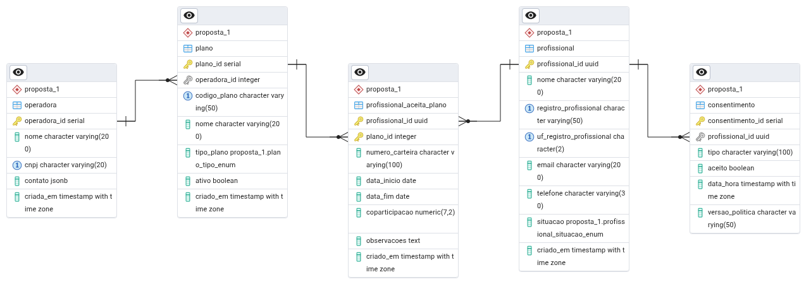
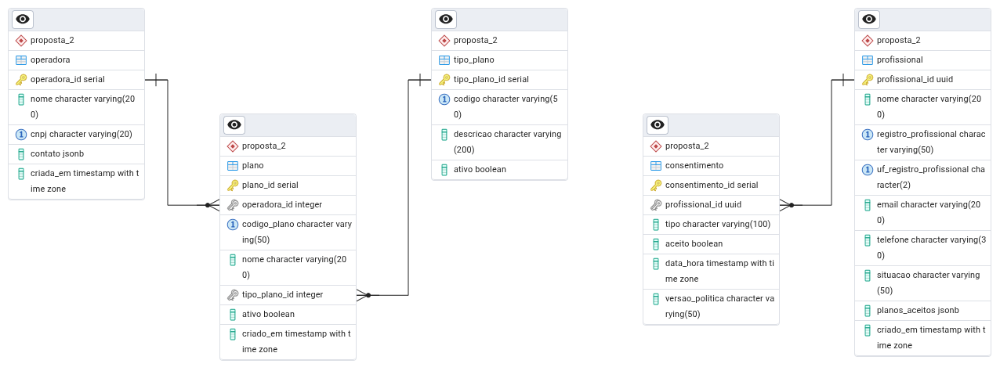

# 📌 Projeto: Modelagem de Banco de Dados — Lacrei Saúde

## 📝 Justificativa Técnica

Este projeto visa modelar e implementar uma estrutura de banco de dados para organizar os **planos de saúde aceitos pelos profissionais** cadastrados na plataforma **Lacrei Saúde**.  
A modelagem buscou equilibrar **integridade dos dados**, **eficiência de consulta** e **flexibilidade para evolução futura**.

Foram propostas **duas abordagens distintas** para atender diferentes necessidades e cenários de crescimento do sistema.

---

## ⚙️ Abordagem 1 — Modelo Relacional Puro

### 🎯 Objetivo
A **Proposta 1** segue um modelo **100% relacional**, garantindo **forte integridade referencial**.

### 📐 Características
- Tabelas normalizadas (**3FN**);
- **Chaves estrangeiras** para relacionamentos entre profissionais, planos e operadoras;
- Tabela intermediária `profissional_aceita_plano` para gerenciar os vínculos;
- **Tipos enumerados (ENUM)** para padronização de dados;
- Índices **BTREE** para consultas otimizadas.

### ✅ Vantagens
- Alta **integridade dos dados**;
- Maior **consistência transacional**;
- Facilidade para implementar **restrições complexas**.

### ⚠️ Desvantagens
- Estrutura mais **rigorosa** e menos flexível;
- Alterações no schema exigem **migrações mais complexas**.

### 🔗 Relacionamento das Tabelas
```
proposta_1
----------
operadora (1) ---< plano (N)
profissional (1) ---< profissional_aceita_plano (N)
plano (1) ---< profissional_aceita_plano (N)
profissional (1) ---< consentimento (N)
```

### 📉 Diagrama Entidade-Relacionamento (DER)
[](modelagem/der_proposta_1.png)

### 💻 Scripts Relacionados
- [📄 DDL Proposta 1](scripts/ddl_proposta_1.sql)  
- [📄 Dicionário de Dados Proposta 1](modelagem/dicionario_proposta_1.md)

---

## 🗂️ Abordagem 2 — Modelo Híbrido com `JSONB`

### 🎯 Objetivo
A **Proposta 2** utiliza uma abordagem **híbrida**, armazenando os **planos aceitos pelos profissionais** diretamente em uma coluna **JSONB**.

### 📐 Características
- A tabela `profissional` possui a coluna `planos_aceitos` do tipo **JSONB**;
- Cada objeto do JSON armazena planos aceitos com detalhes adicionais;
- Índices **GIN** otimizam buscas dentro do JSON;
- **Triggers** garantem que os dados respeitem a estrutura mínima necessária.

### ✅ Vantagens
- Maior **flexibilidade** para armazenar diferentes estruturas;
- Facilita integrações com **APIs externas**;
- Menor necessidade de alterar o schema para novos atributos.

### ⚠️ Desvantagens
- **Integridade referencial limitada** — exige validação via triggers;
- Consultas podem ser mais complexas;
- Dificulta análises avançadas com **JOINs**.

### 🔗 Relacionamento das Tabelas
```
proposta_2
----------
operadora (1) ---< plano (N)
profissional (1) --- (tem) planos_aceitos JSONB
profissional (1) ---< consentimento (N)
```

### 📉 Diagrama Entidade-Relacionamento (DER)
[](modelagem/der_proposta_2.png)

### 💻 Scripts Relacionados
- [📄 DDL Proposta 2](scripts/ddl_proposta_2.sql)  
- [📄 Dicionário de Dados Proposta 2](modelagem/dicionario_proposta_2.md)

---

## 🔍 Reflexão sobre o Uso de `JSONB`

O uso de **JSONB** no PostgreSQL pode ser extremamente poderoso, mas deve ser aplicado com **cautela**.

### 📌 Quando Usar
- Quando a estrutura dos dados **varia com frequência**;
- Para armazenar **dados semiestruturados**;
- Em casos de **integração com APIs externas**.

### 📌 Quando Evitar
- Quando os dados são **altamente relacionais**;
- Quando há necessidade de **consultas analíticas complexas**;
- Quando a **integridade transacional** é prioridade máxima.

### 🚀 Conclusão
- **Proposta 1** → indicada para **consistência e integridade total**;
- **Proposta 2** → melhor para **flexibilidade e performance** em cenários dinâmicos.

---

## 🛡️ Conformidade com a LGPD

A modelagem do banco foi planejada para **respeitar a Lei Geral de Proteção de Dados (LGPD)**:

- **Minimização de Dados** → somente os dados necessários são armazenados;
- **Anonimização e Pseudonimização** → dados sensíveis podem ser ofuscados quando necessário;
- **Registro de Consentimento** → a tabela `consentimento` garante rastreabilidade e transparência;


---

## 📂 Estrutura do Repositório

```
/
├── modelagem/
│   ├── dicionario_proposta_1.md 
│   ├── dicionario_proposta_2.md
│   ├── der_proposta_1.png
│   └── der_proposta_2.png
├── scripts/
│   ├── ddl_proposta_1.sql
│   └── ddl_proposta_2.sql
└── README.md
```

---

## 🧩 Tecnologias Utilizadas
- **Debian 12.5**
- **PostgreSQL 16**
- **DDL + JSONB**
- **Índices GIN / BTREE**
- **Triggers para validação**
